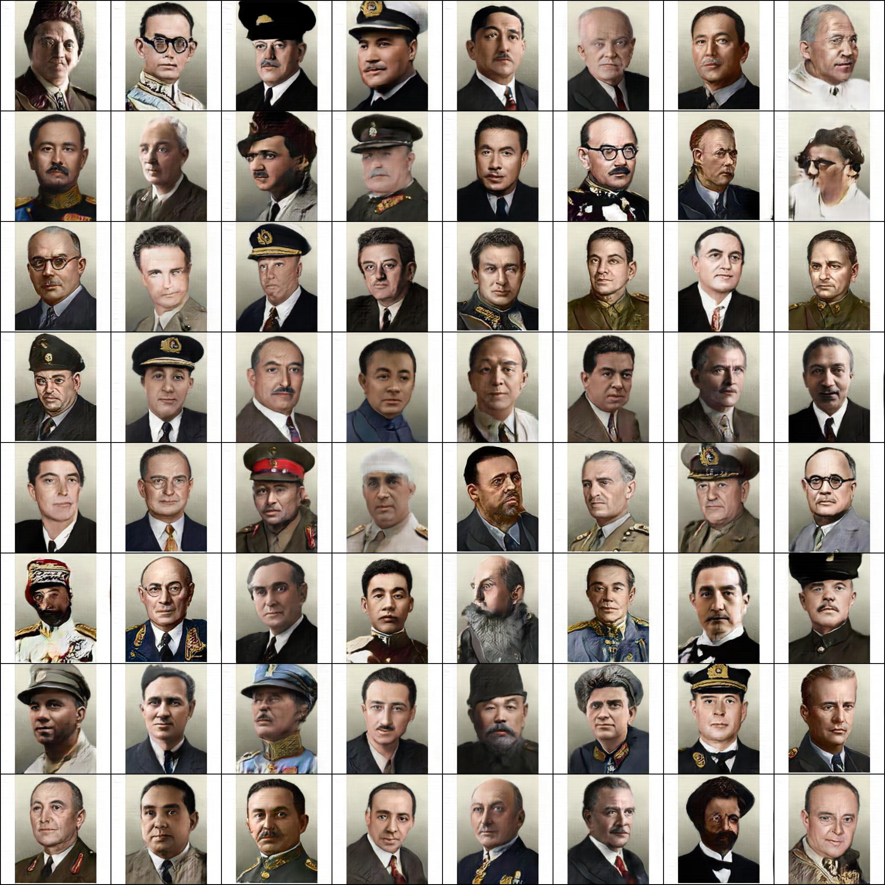

# 钢铁雄心4大众脸生成器/Hearts of Iron IV Generic Face Generator
**项目仍未完成！！**

**The project is still unfinished!!**

</img>

*Results of 27 hours of training*

我是中国人，我的英语不太好，下文中的错误还请大家指出，谢谢。

I'm from China and my English is not very good. Please point out the errors below, thank you.

这是一个基于lightweight-gan的钢铁雄心4大众脸生成AI。

This is an AI that can generate hoi4 generic faces, it is based on lightweight-gan.

lightweight-gan:https://github.com/lucidrains/lightweight-gan
## 我为什么要训练这个AI？/Why did I train this AI?
在钢铁雄心4的mod制作过程中，大众脸绘制问题给mod制作者带来了很多的麻烦，所以我突发奇想，训练了这个AI，想为各位mod作者带来方便，提高制作效率。

The problem of generic face drawing has caused a lot of trouble for modders during the hoi4 mod making process. So in order to improve efficiency, bring convenience to all modders, I trained this AI.
## 用法/Usage
lightweight-gan的具体用法可以参考：

The specific usage of lightweight-gan can refer to:
```bash
https://github.com/lucidrains/lightweight-gan
```
如果你学会了lightweight-gan的用法，那你就可以去<a href="https://github.com/anzai249/hoi4_face_generator/releases">Release</a>页面下载模型文件并解压，然后：

If you have already learned the usage of lightweight-gan, then you can go to the <a href="https://github.com/anzai249/hoi4_face_generator/releases">Release</a> page to download the model file and unzip it, and then:
```bash
$ lightweight_gan --name hoi --generate
```
更多生成选项可以参照：

More generation options can refer to:
```bash
https://github.com/lucidrains/lightweight-gan#generating
```
## Colab
为此我还做了个Colab笔记本。

I also created a Colab notebook for this.
 [](https://colab.research.google.com/drive/18Bb1ibaotSXTgxlMzCaS9rcRzXfKYK7B?usp=sharing)